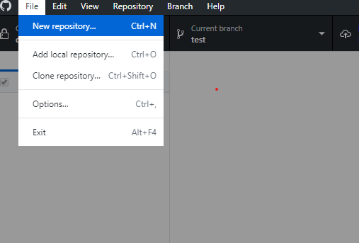
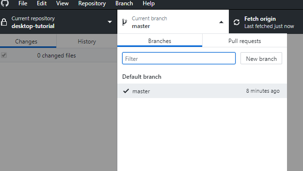
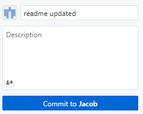
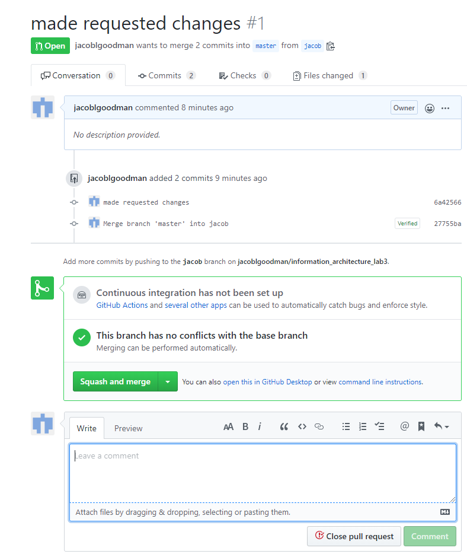

# Lab #3: Develop Code Repository and Push Commits 


**Points: 10**  
**Assignment Type: Group submissions**

### Description:

In this lab, we will learn how to develop a GitHub Repository, generate a repository for a series of  functions and push the changes to a GitHub Repository

You will split up into the same groups designated for your final projects and a submission will be a Repo as a package for each Group. 

The following outlines the structure of the lab: 


1. **GitHub:**
	* 1.1 clone repo 
	* 1.2 create and checkout a branch
	* 1.3 make and commit a change to readme.txt
	* 1.4 push your changes back to GitHub
	* 1.5 merge your changes on github.com
	
2. **script: download date from API and save to S3**
	* 2.1. Create a group repo
	* 2.2. Open .ipynb in jupyter
	* 2.3. move twitter keys into anaconda library 
	* 2.4 run notebook
		* 2.4.1 authenticate
		* 2.4.2 query
		* 2.4.3 munge (data wrangling)
		* 2.4.4 save to S3


## 1. GitHub:
### 1.1 clone repo 

The first step is to "Clone" the repository. This copy's the files to your local computer and creates a connection to repository. 

From the command you can type the following command: 

```bash
git clone <repo url> #replace <repo url> with the url of the reposiotry on github
```


From GitHub desktop you can select clone from the file drop down your use the shortcut `Ctrl+shift+O`:




### 1.2 Create and checkout a branch 


Once we have cloned the repository, we will create a new **branch** with our *name* and  moved our git to this branch by **checking** it out. This will allow us to make and save changes without affecting the "master" branch.

From the command line, 

1. navigate into the repo. 

   ```bash
   cd <repo name> # cd stands for change directory and moves us to the folder we specify <repo name>
   ```

   

2. Create a new branch and check it out we use the checkout command.
```bash
git checkout -b <new-branch>  # the -b flag allows us to create a new repo and check it out in the
						    # same step. don't forget to replace <new-branch> with your name
```

From GitHub desktop, click the current branch dropdown and then select new branch  




### 1.3 make and commit a change to hellogroup.txt

We are now going to modify this repository and save those changes into git by **Committing ** them to the repository.  This will allow us to share our changes back to the repository on github.com.	


We will now make an update to repository:
1. Open the hellogroup.txt file located in the base directory of the repository
2. Write a message for your group
3.  Save the file
4.  Commit those changes 

From the command line to commit changes we must first stage them with `git add` . once 
```bash
git add . # add all files that have changes 
git status # see the changes that are staged
git commit -m "put your commit message here" # commit your changes with a message

```


On GitHub desktop we use the commit button on the bottom left of the screen. 



### 1.4  Push your changes back to GitHub

Once we have have committed our changes to the Local repository we want to share them so our group can see the nice message we wrote them. to do this we **push** the changes. 


From the command line, we use the `push` command. because this is the first time you are pushing this repo and because our new branch doesn't yet exist on github.com we have to use the `-u` option ,which sets the upstream branch so git knows where to push our updates in the future, and we need to specific the remote: origin (the default) and branch name. 


```bash
git push -u origin <branchname> # push your changes to a new remote branch
```


On GitHub desktop the publish branch button will push our changes to a new branch on Github.com  


### 1.6 Merge changes 

Once our branch is published to github.com we want to merge those changes back to the master branch. 


#### 1.6.1 Open a pull request on the repo  https://github.com/yeshivadataanalytics/{reponame}>


#### 1.6.2 Select the branch that you pushed


#### 1.6.3 Resolve any conflicts


#### 1.6.4 commit the merge and close the Pull Request




<br>
<b>Congratulations! You are now a GitHub collaborator!</b>


## 2. Script: download date from API and save to S3.

Now that you have installed GitHub Desktop and collaborated on a piece of code, we are going to develop a basic API call to pull data from a web service and convert it into a file to be consumed into a database. 

### 2.1 make a group repository:

To get started, take the steps necessary to create a repository for your Group. You should title it by the group names and add brandon.chiazza@gmail.com and jacoblgoodman@gmail.com as collaborators to those repositories. 

Upon initiating the GitHub Repo for your Group, create a readme.md file and add the names of the group members to the read me. 

Your result should look something like this: 


```markdown 
# markdown syntax to make table:
|	Name	|	Email	|
|---------------|---------------------|
|Brandon Chiazza|brandon.chiazza@yu.edu|
|Jacob Goodman	|jlgoodm1@mail.yu.edu|
```
### 2.2. Open .ipynb in jupyter

Move the .ipynb file located in the `scripts/tiwtter-api-example`  directory of this repository  to your new repository 

start jupyter and open the file. 	

### 2.3. move twitter keys into anaconda library 

Take the `twitter_keys.py` file and move it into the lib folder of your anaconda installation:  
**Anaconda3\lib\**

this will make the file accessible via the `import` command everywhere on our computers:

```python
import twitter_keys #example
```
if you don't know where your anaconda folder is you can find it with the following command on the command line
```bash
which anaconda # this command should work on both windows and mac
```


### 2.4 run notebook

we will now execute the notebook get some twitter data, clean it, and place it in an S3 bucket

#### 2.4.1 authenticate
the first step in accessing our API is to authenticate ourselves and get a token we will utlize to connect and get our twitter data.

Twitter uses a kind of authentication called  OAuth 2.0 bearer token:    
here is some more information:   
https://www.youtube.com/watch?v=BNEoKexlmA4  
https://medium.com/@technospace/an-introduction-to-oauth-2-0-4c71b5fb19ff  

For us what this means is our first step is to make a **post** request to the authentication end point `https://api.twitter.com/oauth2/token`  to get a string which will be required to make any additional 

Run the first cell of the note book and make sure we get a response code 200 
see the response-codes.md in the repo for more response codes. [Here](response-codes.md)

#### 2.4.2 query

The next step is to take the token we received from our authorization and use it to get the data we are interested in.

1. first we extract the token from the response and save it
2. we create our query
   1. we create a "header" to pass in with our requests
   2. we build the query
3. identify the endpoint
4. send a "get" request with our headers and query to our endpoint

run the cell and make sure we get a response code 200

#### 2.4.3 munge (data wrangling)

At this step we now have our data, but its not usable yet. 

1. first we convert it from json to a python object with the .json() which returns a dict type 
2. then we print a record to verify where the data we want is 
3. we past the 'Statuses' to pd.Dataframe() and run .head(2) to verify the data is now in a dataframe

#### 2.4.4 save to S3

we will now use Pandas to save the data to S3.  the dataframe.to_csv() method has the ability to write directly to an S3 bucket.

1. modify the Filename to be your groups name
2. run the cell and we will see your file on s3

