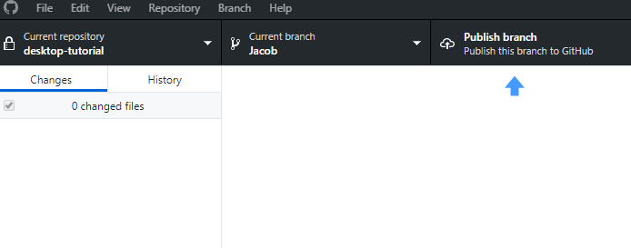

# Lab #3: Develop Code Repository and Push Commits 


**Points: 10 **
**Assignment Type: Group submissions**

### Description:

In this lab, we will learn how to develop a GitHub Repository, generate a repository for a series of  functions and push the changes to a GitHub Repository

You will split up into the same groups designated for your final projects and a submission will be a Repo as a package for each Group. 

The following outlines the structure of the lab: 


1. **GitHub:**
	1.1 clone repo 
	1.2 create and checkout a branch
	1.3 make and commit a change to readme.txt
	1.4 push your changes back to GitHub
	1.5 merge your changes on github.com

2. **script: download date from API and save to S3**
	2.1. open .ipynb in jupyter
	2.2 Updates
	2.3 save to S3


## 1. GitHub:
### 1.1 clone repo 

```bash
git clone <repo url>
```

GitHub desktop:
<kbd>

</kbd>

### 1.2 create and checkout a branch 

```bash
git checkout -b <new-branch>
```
<kbd>

</kbd>

### 1.3 make and commit a change to readme.txt

* **Modify the text in the  box below put a message to your group,**

```
adding above

looking a how to merge files 

and below

```
* Save the file
* Commit those changes 

```bash
git add . # add all files that have changes 
git status # see the changes that are staged
git commit -m "put your commit message here" # commit your changes with a message

```
<kbd>

</kbd>
### 1.4  Push your changes back to GitHub


```bash
git push -u origin <branchname> #push your changes to a new remote branch
```
<kbd>

</kbd>
### 1.6 Merge changes 

#### 1.6.1 Open a pull request on the repo www.github.com/jacoblgoodman/{repo}>
<kbd>

</kbd>


#### 1.6.2 select the branch that you pushed

<kbd>

</kbd>


#### 1.6.3 resolve and conflicts

<kbd>

</kbd>


#### 1.6.4 commit the merge and close the Pull Request

<kbd>

</kbd>

<b>Congratulations! You are now a GitHub collaborator!</b>


## 2. script: download date from API and save to S3:

Now that you have installed GitHub Desktop and collaborated on a piece of code, we are going to develop a basic API call to pull data from a web service and convert it into a file to be consumed into a database. 

To get started, take the steps necessary to create a repository for your Group. You should title it by the group names and add brandon.chiazza@gmail.com and jacoblgoodman@gmail.com as collaborators to those repositories. 

Upon initiating the GitHub Repo for your Group, create a readme.md file and add the names of the group members to the read me. 

Your result should look something like this: 
<kbd>

</kbd>
